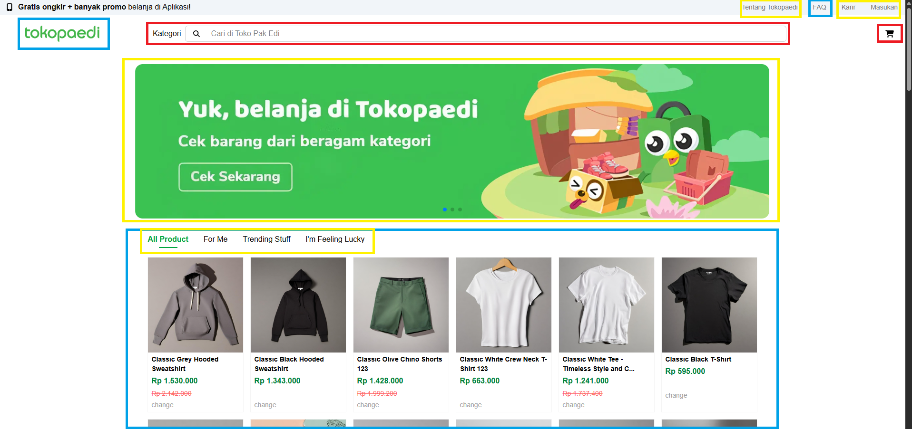
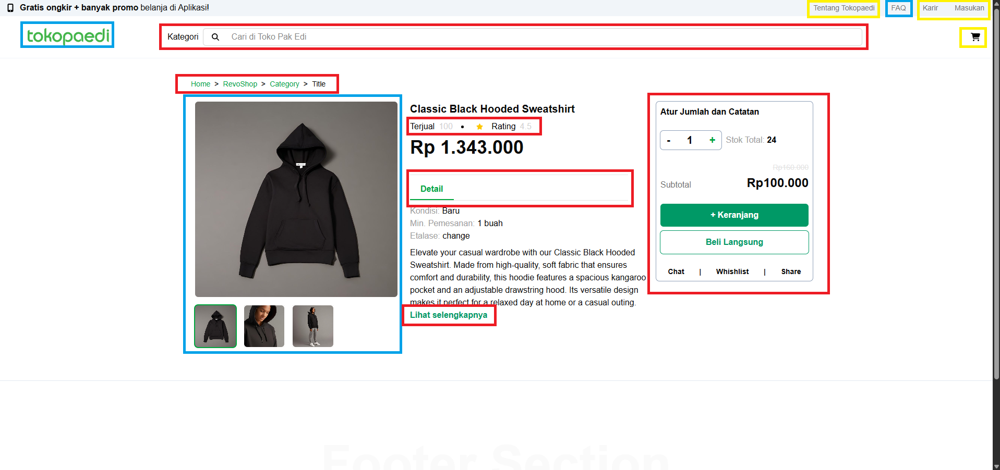
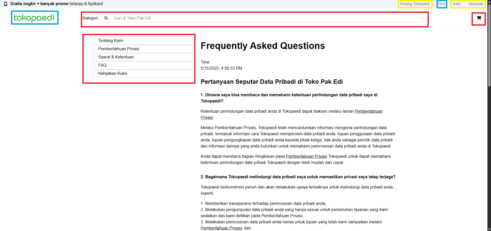

# 💸Module 4 Assignment

Welcome to the repo of my third project, a 'humorous' attempt to duplicate one of the most used site for online-shopping in Indonesia ! I used NextJs as framework and use typescript and tailwind as the development option. Have fun!

### <sub>_(For learning purposes only, please don't sue)_ 🙏🏽

## 🛍️ Start Your Shopping Spree <sub><sub><sub>_kind of..._</sub></sub></sub>

Browse for online product here :

### [Module 4 Assignment](https://tokopaedi-smoky.vercel.app/)

## 💻 Open This Project Locally

Feel free to open and run the project on your local machine!

1. Clone the repository first
   ```sh
   https://github.com/revou-fsse-feb25/milestone-2-kebejoan.git
   ```
2. Navigate to the folder in your CLI
   ```sh
   cd .\milestone-3-kebejoan\
   ```
3. Run the code command (might differ in your machine)
   ```sh
   code .
   ```
4. Install packages using package manager
   ```sh
   npm install 
   ```
5. Deploy on development environment
   ```sh
   npm run dev
   ```

## 🌳 Project Tree
```sh
src/app                      # App root
├── components/              # Components folder
│   ├── Card.tsx             # Card component
│   ├── Footer.tsx           # Footer component
│   ├── FooterSection.tsx    # A section component in the footer
│   ├── Header.tsx           # Header component
│   ├── ProductPageComponents.tsx  # Product page component
│   ├── Utils.tsx            # Utilities component
│   └── index.ts             # Component index
├── faq/                     
│   └── page.tsx             # Page for FAQ [SSG Page]
├── future/                  
│   └── page.tsx             # Page for displaying feature not implemented yet  
├── product\[slug]/          
│   ├── loading.tsx          # Page for when producet\[slug] is loading 
│   └── page.tsx             # Product page (detail product) [SSR Page]
├── services/                
│   └── API.ts               # Script for data fetching 
├── globals.css              # Script for style
├── layout.tsx               # Main page layout
├── page.tsx                 # Main page (product listing) [CSR Page]
└── types.ts                 # Script for type and interface for shared 
```
## 🔥Future Improvement

As I develop this project, some ideas come in mind that would not able to be implemented before the deadline. Those ideas are:

- filter product by category
- search feature
- finish checkout float
- menu in faq page
- product listing menu
- cart
- newsline header/topside
  
_and more..._

## ✅ Working Features/Page
Out of all three pages in the screenshots, working state of the component are explain below:

- Blue Squared : `Fully works`
- Yellow Squared   : `Partially works or only opening temporary page`
- Red Squared   : `Doesn't work at all`

## 📸 Screenshots



